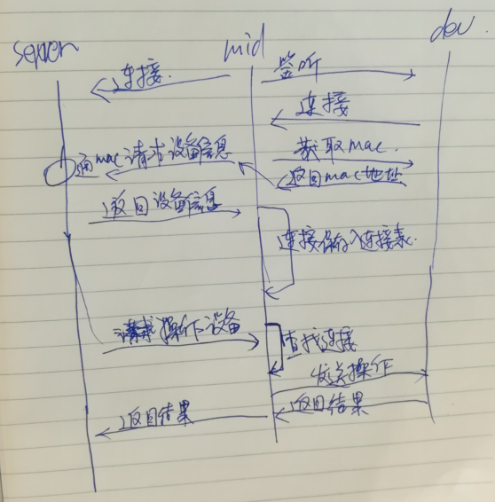

# 中间层服务流程

## 服务器、中间件、设备之间的通信流程

## 中间件的实现流程

### RS485/RS232转wifi设备功能
- [x] 返回设备ID(MAC地址或SN)
- [x] 串口数据的传输
- [x] 心跳
- []  返回用户配置信息

### 连接管理
1. 和主服务器建立一条TCP连接，通过JSON传输,如`{"MAC":"AA:BB:CC:DD:EE:FF","DevType":"塔吊","Action":"获取高度"}`
2. 和每个设备建立一条TCP连接，通过JSON传输
    - 每个连接需要保持设备信息
    -

## 消息说明
中间件和服务器通信格式 MsgType:Serv 如:{"MsgType":"Serv","Action":"DevList","Data":["500001",600001]} //5 6区分不同类型 Action:

DevList
服务器通过中间件和设备通信 MsgType:Devices 如：{"MsgType":"Devices","ID":"500001","Action":"每日电量"} //服务器发给中间件

{"MsgType":"Devices","ID":"500001","Action":"每日电量","Data":"600度"} //中间件发给服务器